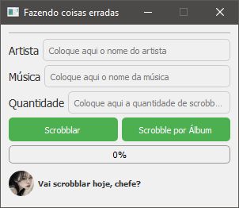

# Scrobbler App


Este repositório contém o **Scrobbler App**, um aplicativo desenvolvido em Python que permite ao usuário fazer scrobbling de músicas e álbuns diretamente em sua conta Last.fm de maneira automatizada, utilizando a API do Last.fm.

## Funcionalidades

- **Autenticação com Last.fm**: Permite ao usuário autenticar-se com a sua conta Last.fm utilizando chave API e API Secret.
- **Scrobbling de músicas e álbuns**: Possibilidade de realizar scrobbling de uma música ou álbum, com controle da quantidade.
- **Modo Álbum ou Faixa**: Alternar entre scrobbling de um álbum inteiro ou de uma faixa.
- **Controle de Atualizações**: Verifica automaticamente por atualizações disponíveis e permite a atualização do aplicativo.
- **Interface Gráfica com PyQt5**: Aplicativo fácil de usar com interface amigável desenvolvida em PyQt5.

## Captura de Tela



## Como Usar

### Requisitos

- **Python 3.7+**
- **PyQt5**
- **pylast**
- **requests**

### Instalação

1. Clone o repositório:

   ```bash
   git clone https://github.com/gabriel193/scrobbler.git
   cd scrobbler
   ```

2. Crie um ambiente virtual e ative-o:

   **No Windows**:
   ```bash
   python -m venv venv
   venv\Scripts\activate
   ```

   **No macOS/Linux**:
   ```bash
   python3 -m venv venv
   source venv/bin/activate
   ```

3. Instale as dependências:

   ```bash
   pip install -r requirements.txt
   ```

4. Gere o executável (opcional):

   ```bash
   pyinstaller --onefile --icon=./resources/app.ico --add-data "./resources/app.ico;." main.py
   ```

### Uso

1. Execute o aplicativo:

   ```bash
   python main.py
   ```

2. Insira suas credenciais do Last.fm (username, API key, API secret).
3. Escolha o artista, faixa ou álbum, e a quantidade de scrobbles.
4. Clique em **Scrobblar** e acompanhe o progresso na interface.

## Atualizações

O aplicativo verifica automaticamente se uma nova versão está disponível no GitHub e, caso haja, oferece a opção de baixar e instalar a atualização.

## Estrutura do Projeto

- **main.py**: Arquivo principal que inicializa a aplicação.
- **app.py**: Contém a lógica principal da interface gráfica.
- **threads.py**: Threads para scrobbling de faixas e álbuns.
- **utils.py**: Funções utilitárias, como verificação de atualizações.
- **scrobbler_ui.py**: Layout da interface construído com PyQt5.

## Contribuições

São bem-vindas contribuições para melhorias e correções do projeto! Sinta-se à vontade para abrir uma *issue* ou enviar um *pull request*.

## Licença

Este projeto está licenciado sob a Licença MIT - veja o arquivo [LICENSE](LICENSE) para mais detalhes.

## Contato

- **Autor**: Gabriel193
- **GitHub**: [gabriel193](https://github.com/gabriel193)
- **Last.fm API**: [Last.fm API](https://www.last.fm/api)

Se tiver alguma dúvida ou sugestão, entre em contato! Espero que este aplicativo seja útil para você.

